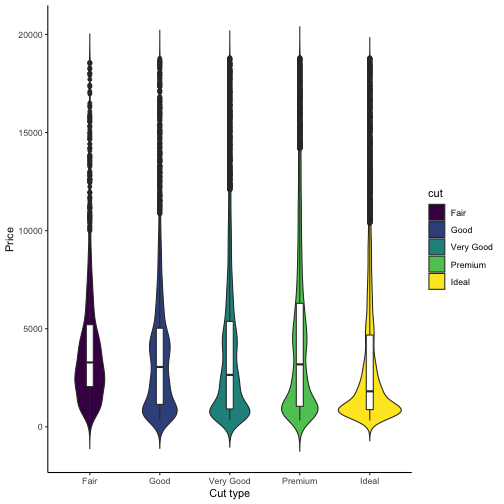

Predicting diamond prices
========================================================
author: Panayiotis L.
date: 27 Sep 2020
autosize: false

Modivation
========================================================

The price of diamonds is estimated based on many different factors. The owners
of the diamonds need to know their worth before they sell them. We designed
a shiny app, which tries to predict the price of diamonds based on two parameters:

- Carat value
- Cut type

We designed two different linear models, one uses both variables and the other
uses only the carat value to predict the price of diamonds. We used the diamonds
dataset from the ggplot2 library to create our models.

Let's take a look at the diamonds data.

Diamonds data summary
========================================================


```
tibble [53,940 × 10] (S3: tbl_df/tbl/data.frame)
 $ carat  : num [1:53940] 0.23 0.21 0.23 0.29 0.31 0.24 0.24 0.26 0.22 0.23 ...
 $ cut    : Ord.factor w/ 5 levels "Fair"<"Good"<..: 5 4 2 4 2 3 3 3 1 3 ...
 $ color  : Ord.factor w/ 7 levels "D"<"E"<"F"<"G"<..: 2 2 2 6 7 7 6 5 2 5 ...
 $ clarity: Ord.factor w/ 8 levels "I1"<"SI2"<"SI1"<..: 2 3 5 4 2 6 7 3 4 5 ...
 $ depth  : num [1:53940] 61.5 59.8 56.9 62.4 63.3 62.8 62.3 61.9 65.1 59.4 ...
 $ table  : num [1:53940] 55 61 65 58 58 57 57 55 61 61 ...
 $ price  : int [1:53940] 326 326 327 334 335 336 336 337 337 338 ...
 $ x      : num [1:53940] 3.95 3.89 4.05 4.2 4.34 3.94 3.95 4.07 3.87 4 ...
 $ y      : num [1:53940] 3.98 3.84 4.07 4.23 4.35 3.96 3.98 4.11 3.78 4.05 ...
 $ z      : num [1:53940] 2.43 2.31 2.31 2.63 2.75 2.48 2.47 2.53 2.49 2.39 ...
```

Diamond price per cut type
========================================================



How to use the shinyPredictor
========================================================

The shinyPredictor is very simple to use and can be found here:
<https://ghost-8d.shinyapps.io/shinyPredictor/>

Steps:

1. Select the carat value, using the 1st slider.
2. Select the cut type, using the 2nd slider.
3. Click on submit to get the predictions from the two linear models.

You can follow the above steps and try different values.
